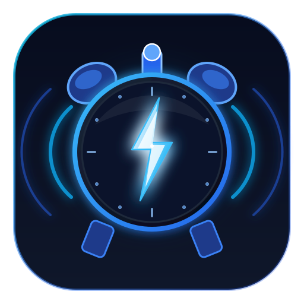
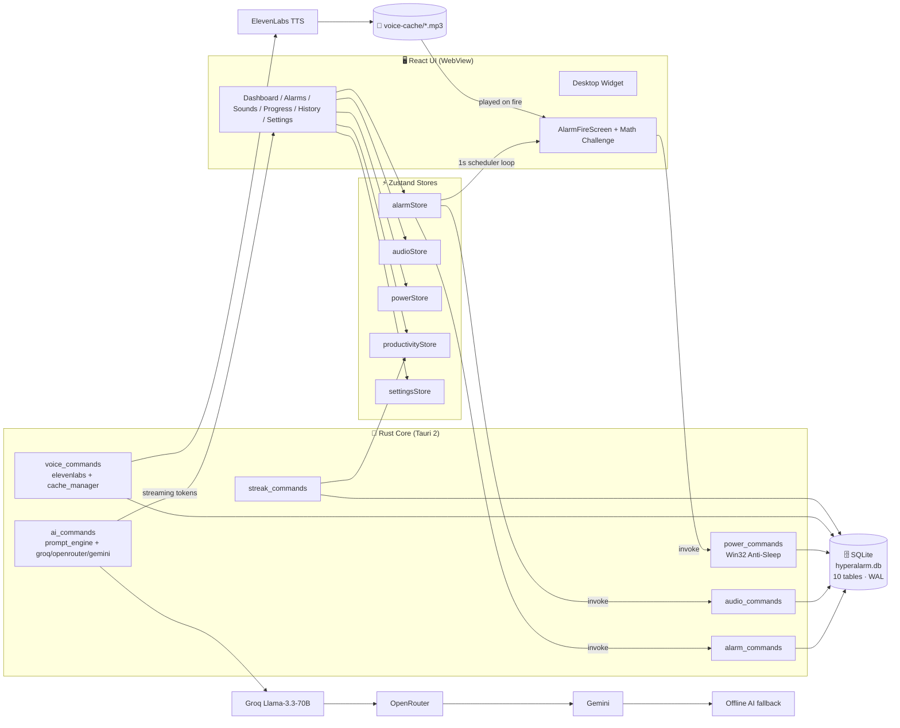
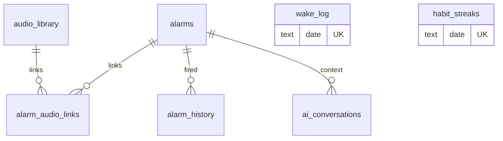
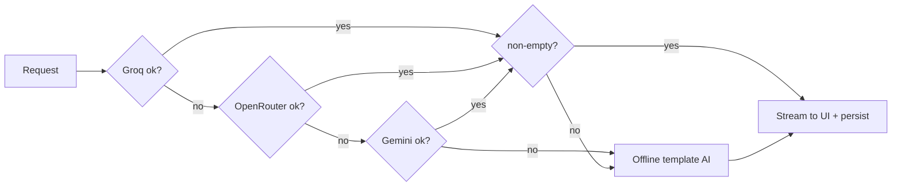

<div align="center">



# ⚡ HyperAlarm Pro

> ### **Wake up. Level up.**


📦 **Repo:** [mwijay12/hype-alarm](https://github.com/mwijay12/hype-alarm)

---

## 📑 Table of Contents

| # | Section | # | Section |
|---|---------|---|---------|
| 1 | [🚀 Project Identity](#-section-1-project-identity) | 9 | [🐛 Limitations & Bugs](#-section-9-current-limitations--known-bugs) |
| 2 | [📸 Live System Snapshot](#-section-2-live-system-snapshot) | 10 | [🧩 Modification Guide](#-section-10-modification--addon-guide) |
| 3 | [🏗️ System Architecture](#%EF%B8%8F-section-3-system-architecture) | 11 | [🚢 Deployment Guide](#-section-11-deployment-guide) |
| 4 | [📁 File Structure](#-section-4-complete-file-structure) | 12 | [💰 Cost Calculator](#-section-12-cost-calculator) |
| 5 | [🧰 Installation & Setup](#-section-5-installation--setup) | 13 | [🗺️ Roadmap](#-section-13-roadmap) |
| 6 | [🎮 How To Use It](#-section-6-how-to-use-it) | 14 | [🎓 Lessons Learned](#-section-14-lessons-learned) |
| 7 | [🗄️ Database Schema](#%EF%B8%8F-section-7-database-schema-sqlite) | 15 | [⚡ Quick Reference Card](#-section-15-quick-reference-card) |
| 8 | [🤖 AI Integration](#-section-8-ai-integration-details) | — | — |

</div>

---

# 🚀 SECTION 1: PROJECT IDENTITY

<div align="center">

> *"Your alarm clock is broken. We fixed it — then gave it a brain, a voice, and a personality."*

</div>

### 👶 For a 10-year-old
Imagine a normal alarm clock, but a tiny robot coach lives inside your computer. Every night at **23:45** the robot quietly records a personal wake-up message for tomorrow morning — it knows your streak, your goals, even that you snoozed yesterday. When your alarm rings, the app window **jumps on top of everything**, your PC **refuses to fall asleep**, and the robot cheers you out of bed. Wake up on time → earn points → keep your 🔥 streak alive.

### 👨‍💻 For a developer
**HyperAlarm Pro** is a native desktop alarm application built with **Tauri 2 (Rust backend)** and **React 18 + TypeScript (WebView frontend)**. A 1-second scheduler loop evaluates alarms stored in a **local SQLite database** (`hyperalarm.db`, WAL mode, 10 tables). On fire, it escalates: `always-on-top` window takeover → native OS notification → **audio engine with up to 400 % volume boost** → **ElevenLabs TTS voice intro pre-generated the night before** → **streamed AI morning check-in** with a 3-tier provider fallback chain (Groq → OpenRouter → Gemini) plus a fully **offline deterministic fallback**, so the morning ritual never breaks. A **Win32 `SetThreadExecutionState` anti-sleep engine** guarantees the machine can't drift into standby before the alarm. Zero accounts, zero telemetry — data lives 100 % on-device.

### 💼 For an investor
Sleep-deprived professionals snooze ~3 times per morning and lose their best hours to "just five more minutes." Phone alarms are trivially dismissible — and the phone *is* the distraction, not the solution. HyperAlarm Pro is a **desktop-first morning-discipline system**: it owns the exact screen you're about to work on, makes the PC physically incapable of sleeping through your alarm, converts wake-ups into a **quantified habit** (streaks, heatmaps, morning scores), and layers a **personalized AI accountability coach** on top. A freemium wedge into the multi-billion-dollar sleep-tech market with **near-zero infrastructure cost** — everything is local-first and AI costs are BYO-key.

### 🧑‍🚀 Who built it & why
Built by **[Mwijay](https://github.com/mwijay12)** — a solo developer tired of snoozing through his own goals. What started as *"I need a louder alarm on my PC"* grew phase-by-phase (the codebase is literally stamped `Phase 7 → Phase 10`) into a full morning-performance system: **alarms → productivity hub → ElevenLabs voice → AI check-in → desktop widget**. It also doubles as a serious showcase of production-grade Tauri + Rust + React engineering.

### 💎 What makes it different
| Every other alarm app | HyperAlarm Pro |
|---|---|
| One dismiss button, zero friction | **Math challenge** + snooze limits + snooze-aware AI accountability 😄 |
| Fires while your PC is asleep | **Win32 Anti-Sleep engine** keeps the machine awake on purpose |
| Sound plays, you scroll past it | **Always-on-top takeover window** + native notification + 400 % boosted audio |
| Static "Good morning" | **AI voice message pre-generated at 23:45** with your real streak, goals & snooze history |
| One AI provider; dies when it's down | **Groq → OpenRouter → Gemini → offline** graceful degradation chain |
| Your data lives in someone's cloud | **Local-first SQLite** — no account, no telemetry, no lock-in |
| It's just an app | App **+ always-on-top transparent desktop widget + system-tray lifecycle** |

**One-line positioning:** *The morning-discipline OS for your PC.*

---

# 📸 SECTION 2: LIVE SYSTEM SNAPSHOT

> **State as of today: `v0.1.0`, branch `main` @ `daf62c7`.** No Firebase, no backend server, no cloud DB — by design. This is a **local-first desktop app**; the only network calls go to the AI/voice providers you configure yourself.

| Component | Status | What It Does | Tech Used |
|---|---|---|---|
| Alarm engine | 🟢 Working | CRUD alarms, repeat patterns (once/daily/weekdays/weekends/custom), 1-second fire loop, snooze w/ limits, `once` auto-deactivation | React + Zustand + SQLite |
| Audio engine | 🟢 Working | Per-alarm MP3 playback, waveform trim (start/end ms), fade-in, 100–400 % volume boost, bundled sample sounds | Web Audio + wavesurfer.js + Rust file bridge |
| Sound Library | 🟢 Working | Import, preview, trim, attach audio; files copied into app data so they survive being moved/deleted | Tauri fs/dialog plugins |
| Math challenge dismiss | 🟢 Working | Math problem generated on the fire screen; must be solved to dismiss; easy→hard difficulty | React |
| Anti-Sleep engine | 🟢 Working | Auto-enables while any alarm is active/firing/snoozed; blocks system + display sleep | Rust `windows` crate (Win32) |
| AI Morning Check-in | 🟢 Working | Context-aware streamed chat after dismissal (streak, goals, snoozes injected into prompt) | Groq Llama-3.3-70B SSE |
| AI fallback chain | 🟢 Working | Groq → OpenRouter → Gemini Direct → offline deterministic replies | Rust reqwest × 3 clients |
| Morning Briefing | 🟢 Working | One-per-day AI briefing (greeting/streak/goals/tip/close), persisted & re-readable | Rust + SQLite |
| AI voice messages | 🟢 Working | Per-alarm TTS generated from your real stats; 4 personalities (Motivational/Gentle/Military/Coach) | ElevenLabs + Rust |
| Voice pre-cache | 🟢 Working | Nightly 23:45 job + startup check (3 s delay) pre-generates tomorrow's voices → instant wake-up | Rust + SQLite |
| Offline AI | 🟢 Working | Zero API keys? Check-in still works via template-based dynamic responses | TypeScript fallback |
| Productivity hub | 🟢 Working | Daily goals, wake streaks, morning score, habit heatmap, weekly charts | Recharts + SQLite |
| History | 🟢 Working | Every wake event: scheduled vs actual, snooze count, on-time flag | SQLite `wake_log` |
| Desktop widget | 🟢 Working | Transparent always-on-top mini clock showing next alarm; toggled from tray | Tauri 2nd window (380×175) |
| System tray | 🟢 Working | Open / Toggle widget / Quit; ✕ hides to tray so alarms keep running | Tauri tray-icon |
| Dark mode | 🟢 Working | Light / dark / system, persisted | CSS vars + `useTheme` |
| Autostart & notifications | 🟢 Working | Launch-on-boot option; native OS notifications on fire | Tauri plugins |
| BYO API keys | 🟢 Working | Keys entered in Settings UI → stored in local DB; never bundled, never committed | SQLite `settings` |

### ✅ Fully working right now (specifics)
- [x] Create/edit/delete alarms with per-alarm: label, time, repeat pattern, custom day picker, snooze duration (5–30 min), snooze limit (1–5), volume boost, fade-in, math challenge + difficulty
- [x] Alarms persist across restarts (SQLite); scheduler re-arms automatically on boot
- [x] Snooze chain with per-alarm count cap — refuses to re-fire past the limit
- [x] Waveform trimmer: pick the exact 30-second slice of your song that wakes you
- [x] Fire takeover: unminimize + focus + always-on-top + notification + boosted audio
- [x] AI check-in chat with **streaming tokens** (`ai:checkin:token` events) and conversation persistence
- [x] ElevenLabs voice per alarm + preview generation + key validation + cache cleanup
- [x] Streaks: current, longest, success rate, this-week/month scores; 30-day habit heatmap
- [x] Daily goals with sort order, completion tracking, feeding into morning score

### 🟡 Partially working
| Feature | Works | Doesn't (yet) |
|---|---|---|
| Voice picker | 5 curated voices (Rachel, Domi, Bella, Antoni, Arnold) | Full voice catalog browsing/search |
| Desktop widget | Size + always-on-top controls | Remembering user-dragged position |
| Morning score | Computed & stored daily | Tunable weights / custom scoring |
| Browser dev mode | Full UI in plain browser via `localStorage` fallback | No OS features (no real alarms, tray, TTS) |
| ElevenLabs quota | Works until free tier exhausted | No quota meter/warning in UI |

### ⚪ Planned, not started
- [ ] Cloud sync (multi-device alarms & streaks)
- [ ] Mobile companion (Tauri 2 iOS/Android)
- [ ] Sleep analytics (bedtime vs wake trends)
- [ ] Streaming radio / YouTube alarm sources
- [ ] In-app onboarding wizard + landing page

### ❌ Tried and abandoned (and why)
- **Firebase (auth/Firestore)** — evaluated at project start. **Killed because a local alarm clock must not depend on cloud availability**, account state, or latency. Local-first SQLite won; only a stray `firebase-debug.log` remains as a fossil. This is also why the AI key model is **BYO-key** instead of a proxied backend.
- **Single-provider AI (Groq only)** — first AI implementation was Groq-only and hard-failed on rate limits/outages. Rebuilt as the 3-tier fallback chain + offline mode after one too many "AI is down" mornings.

---

# 🏗️ SECTION 3: SYSTEM ARCHITECTURE

## The big picture (ASCII)

```text
                                    ┌──────────────────────────────────────────────────┐
                                    │              WINDOWS 10 / 11 DESKTOP             │
                                    │                                                  │
 ┌───────────────┐   click / tray   │  ┌────────────────────────────────────────────┐  │
 │     USER      │◄────────────────►│  │        MAIN WINDOW (WebView, 1100×720)     │  │
 └───────┬───────┘                  │  │  React 18 + TS + Tailwind + Framer Motion  │  │
         │  sees widget             │  │  HashRouter: / /alarms /sounds /progress   │  │
         ▼                          │  │             /history /settings             │  │
 ┌───────────────┐                  │  └───────┬─────────────────────────┬──────────┘  │
 │ WIDGET WINDOW │◄──── mirrored ───┼──────────┼─────────────┐           │             │
 │ (380×175, on- │                  │          │             │           │             │
 │  top, transp.)│                  │          ▼             ▼           ▼             │
 └───────────────┘                  │   Zustand stores (alarm / audio / power /        │
                                    │   productivity / settings) + hooks               │
                                    │        │                │            │            │
                                    │        │ useAlarmScheduler (1s loop) │            │
                                    │        │                │            │            │
                                    │        ▼                ▼            ▼            │
                                    │  ┌────────────┐  ┌────────────┐ ┌────────────┐   │
                                    │  │ AudioEngine│  │ AlarmFire  │ │ AI Checkin │   │
                                    │  │ boost/fade │  │ Screen +   │ │ chat (SSE) │   │
                                    │  │ trim       │  │ math chall.│ │            │   │
                                    │  └─────┬──────┘  └─────┬──────┘ └─────┬──────┘   │
                                    └────────┼───────────────┼──────────────┼──────────┘
                                             │  Tauri IPC (invoke / listen)  │
                                    ┌────────▼───────────────▼──────────────▼──────────┐
                                    │            RUST CORE (Tauri 2, lib.rs)           │
                                    │  commands: alarm / audio / power / ai / voice /  │
                                    │            streak / widget / window              │
                                    │   ┌──────────┐ ┌───────────────┐ ┌────────────┐  │
                                    │   │ ai/      │ │ voice/        │ │ power/     │  │
                                    │   │ groq.rs  │ │ elevenlabs.rs │ │ Win32      │  │
                                    │   │ openrtr. │ │ cache_mgr.rs  │ │ SetThread  │  │
                                    │   │ gemini.rs│ │ script_gen.rs │ │ ExecState  │  │
                                    │   │ prompt_  │ └──────┬────────┘ └────────────┘  │
                                    │   │ engine.rs│        │ downloads MP3            │  │
                                    │   └────┬─────┘        ▼                          │
                                    │        │     %APPDATA%/com.hyperalarmpro.desktop │
                                    │        ▼     ├── hyperalarm.db (SQLite, WAL)      │
                                    └────────┼─────└── voice-cache/*.mp3 ───────────────┘
                                             │
        ┌────────────────────────────────────┼──────────────────────────────────────┐
        ▼                                    ▼                                      ▼
┌───────────────┐                  ┌────────────────┐                    ┌────────────────┐
│  GROQ API     │  fallback →      │ OPENROUTER API │  fallback →        │  GEMINI API    │
│ llama-3.3-70b │─────────────────►│ (any model)    │───────────────────►│ (direct)       │
│ SSE streaming │                  │ SSE streaming  │                    │ non-stream     │
└───────────────┘                  └────────────────┘                    └────────────────┘
        all three fail → OFFLINE fallback (TS template AI) ──► always responds

┌───────────────┐
│ ELEVENLABS    │  TTS: script (Rust) → MP3 → voice-cache/ → played on fire
└───────────────┘
```

## Same architecture as Mermaid (renders on GitHub)



## 🚨 Walkthrough: what happens when your 06:30 alarm fires

This is the hottest code path in the app. Follow the execution line by line:

| Step | Where (file) | What executes |
|---|---|---|
| 1 | `src/App.tsx` → `AppInitializer.tsx` | App booted earlier: `initDatabase()` created all 10 tables + indexes (never throws — falls back to `localStorage` in plain-browser dev), `loadAlarms()` filled `alarmStore` |
| 2 | `src/hooks/useAlarmScheduler.ts` | A `setInterval` tick fires **every 1000 ms**. It checks (a) snoozed alarms past `snoozeUntil`, then (b) each active alarm via `shouldAlarmFire(alarm, now)` (matches hour/minute/day pattern) |
| 3 | `useAlarmScheduler.ts` | Guard: `lastFiredMinuteMapRef` blocks double-firing within the same minute-key `YYYY-M-D_H:MM` |
| 4 | `useAlarmScheduler.ts` → `triggerAlarm()` | `setFiringAlarm(alarm, 0)` → `alarmStore.firingAlarm` set → `AlarmFireScreen` mounts (full-screen takeover with your custom audio + optional math challenge) |
| 5 | `src/store/powerStore.ts` → Rust | `enableAntiSleep()` → `invoke("enable_anti_sleep")` → `power_commands.rs` calls Win32 `SetThreadExecutionState(ES_CONTINUOUS | ES_SYSTEM_REQUIRED | ES_DISPLAY_REQUIRED)` in an `unsafe` block → **Windows cannot sleep or turn off the display** |
| 6 | `useAlarmScheduler.ts` → `wakeUpWindowAndNotify()` | Tauri window API: `show() → unminimize() → setFocus() → setAlwaysOnTop(true)`; then `plugin-notification` fires a native toast: *"⏰ HyperAlarm Pro: {label}"* |
| 7 | `src/hooks/useAlarmAudio.ts` + `useAudioEngine.ts` | Resolves the alarm's audio path (copied into app data at import time by `audio_commands.rs`), applies `audio_start_ms / audio_end_ms` trim, `volume_boost` gain (Web Audio `GainNode`), `fade_in_seconds` ramp |
| 8 | `src/components/ai/VoicePlayer.tsx` | If AI voice enabled: `invoke("check_voice_cache")` → if the 23:45 pre-cache job produced `voice-cache/<alarm>.mp3`, it plays **instantly offline**, then calls `onComplete()`. No cache + no key → step is skipped gracefully |
| 9 | You wake up 🎉 (or snooze) | **Snooze:** `alarmStore.snoozeAlarm()` stores `{alarm, snoozeUntil = now + duration, snoozeCount+1}` → loop re-fires it at step 2 until `snoozeLimit` is hit. Math challenge must be solved first if enabled |
| 10 | `alarmStore.dismissAlarm()` | `invoke` path → `dbLogWakeEvent()` writes a row to `wake_log` (scheduled vs actual, `snoozeCount`, `dismissedOnTime`) |
| 11 | `productivityStore.recordHabitDay()` → Rust | Upserts today's `habit_streaks` row (woke_on_time, alarms fired/snoozed, goals completed/total, computed `morning_score`) → streak + heatmap + charts refresh |
| 12 | `useAlarmScheduler.ts` | If `repeatPattern === "once"` → `dbToggleAlarm(id, false)` auto-deactivates the alarm |
| 13 | `useAICheckin.ts` → `start_morning_checkin` | Sends `MorningContext {alarm_label, hour, minute, current_streak, today_goals, snooze_count, ai_personality, this_week_score}` to Rust |
| 14 | `src-tauri/src/ai/prompt_engine.rs` | `build_opening_message()` + `build_system_prompt()` weave your **real** stats into the prompt (see Section 8) and insert an `ai_conversations` row |
| 15 | `ai_commands.rs` → fallback chain | Tries **Groq SSE** (`llama-3.3-70b-versatile`, 220 tokens, temp 0.7) → **OpenRouter** (250 tokens, temp 0.75) → **Gemini direct** (250 tokens) → if all fail, the **TS offline AI** (`offlineAiService.ts`) composes a deterministic reply from templates |
| 16 | Frontend | Tokens stream in live via `listen("ai:checkin:token")`; final reply appended to the conversation; you're officially awake and briefed ☀️ |

> **Resilience guarantee:** steps 8–16 are *all optional*. With zero keys and zero internet, steps 1–12 alone still deliver a loud, boosted, can't-miss alarm.

---

# 📁 SECTION 4: COMPLETE FILE STRUCTURE

```text
hype-alarm/
├── README.md                      # 📖 This living document
├── package.json                   # NPM scripts (dev/build/tauri) + all frontend deps
├── package-lock.json              # Locked dependency tree (deterministic installs)
├── index.html                     # Vite entry HTML; loads /src/main.tsx
├── vite.config.ts                 # Vite config; port 1420 (Tauri-required), React plugin
├── tsconfig.json / tsconfig.node.json  # TS strict config for app & build tooling
├── tailwind.config.js             # Theme tokens, dark mode ("class"), glass helpers
├── postcss.config.js              # Tailwind + Autoprefixer pipeline
├── components.json                # shadcn/ui generator config (Radix components)
├── .env.example                   # Template for BYO API keys (never commit .env)
├── .gitignore                     # Ignores node_modules, dist, .env, target/
├── generate_icons.py              # Python/PIL script rendering the Tauri icon set
├── firebase-debug.log             # 🦴 Fossil of the abandoned Firebase experiment (deletable)
│
├── public/
│   └── app-icon.svg               # 🤖 App mascot logo (README + UI)
│
└── src/                           # ════════ FRONTEND (React + TS) ════════
    ├── main.tsx                   # React root; mounts <App/> + global CSS
    ├── App.tsx                    # HashRouter: /, /alarms, /sounds, /progress,
    │                              #   /history, /settings + /widget (2nd window)
    ├── App.css / index.css        # Tailwind layers, glass cards, theme vars
    ├── vite-env.d.ts              # Vite type shims (.env typing, asset imports)
    │
    ├── pages/
    │   ├── Dashboard.tsx          # Home: digital clock, next alarm, AI briefing,
    │   │                          #   goals, streak ring, quick stats
    │   ├── Alarms.tsx             # Alarm list/grid + create/edit modal wiring
    │   ├── SoundLibrary.tsx       # Import audio, waveform trim, preview, attach
    │   ├── Productivity.tsx       # Progress hub: streaks, heatmap, charts, goals
    │   ├── History.tsx            # Wake-event log (scheduled vs actual)
    │   └── Settings.tsx           # Theme, defaults, AI keys, voice, autostart
    │
    ├── components/
    │   ├── AppInitializer.tsx     # Boot: init DB → load settings/alarms → start
    │   │                          #   audio engine + scheduler (never blocks UI)
    │   ├── layout/
    │   │   ├── Layout.tsx         # App shell: sidebar + titlebar + routed content
    │   │   ├── Sidebar.tsx        # Nav (lucide icons), active glow
    │   │   └── TitleBar.tsx       # Custom titlebar; minimize/max/close → tray
    │   ├── alarm/
    │   │   ├── AlarmCard.tsx      # Row: time, days, badges (math/boost/AI voice)
    │   │   ├── AlarmList.tsx      # Sorted list + empty state
    │   │   ├── AlarmForm.tsx      # Pure form fields (time, repeat, snooze, audio…)
    │   │   ├── AlarmFormModal.tsx # Modal: add/edit modes, validation, save
    │   │   ├── AlarmFireScreen.tsx# 🔥 Full-screen firing UI: boosted audio, math
    │   │   │                      #   challenge, AI voice, snooze/dismiss
    │   │   └── DeleteAlarmDialog.tsx # Confirm-delete dialog
    │   ├── audio/
    │   │   ├── AudioEngine.tsx    # Singleton Web Audio context (mounted once)
    │   │   ├── AudioPreviewPlayer.tsx # Library preview with boost applied
    │   │   ├── BoostSlider.tsx    # 100–400 % boost slider
    │   │   └── WaveformTrimmer.tsx# wavesurfer.js waveform + draggable trim region
    │   ├── ai/
    │   │   ├── AICheckin.tsx      # Post-dismiss chat UI (streams tokens live)
    │   │   ├── MorningCheckin.tsx # Dashboard check-in entry card
    │   │   ├── MorningBriefingCard.tsx # Renders today's persisted briefing
    │   │   ├── VoiceCompanion.tsx # Voice step container (personality-aware)
    │   │   └── VoicePlayer.tsx    # Plays cached TTS MP3; skips gracefully if absent
    │   ├── productivity/
    │   │   ├── DailyGoalsCard.tsx # Today's goals checklist (add/complete/delete)
    │   │   ├── GoalsList.tsx      # Goal rows with sort order
    │   │   ├── HabitHeatmap.tsx   # 30-day wake-up heatmap grid
    │   │   ├── MorningScoreRing.tsx # Animated score ring (0–100)
    │   │   ├── StatsChart.tsx     # Recharts weekly stats
    │   │   ├── WeeklyChart.tsx    # Bars: on-time vs snoozed per day
    │   │   └── StreakCounter.tsx  # 🔥 current/longest streak display
    │   └── ui/                    # shadcn/ui primitives + custom glass widgets
    │       ├── DesktopWidget.tsx  # /widget route: transparent always-on-top clock
    │       ├── DigitalClock.tsx   # Big monospace clock
    │       ├── GlassCard.tsx      # Glassmorphism container (light+dark)
    │       ├── GlowButton.tsx     # Primary glowing CTA
    │       ├── AppLogo.tsx        # Logo w/ optional hover animation
    │       ├── StatusDot.tsx / Toast.tsx # Status indicator + toasts
    │       └── badge, button, card, dialog, input, label, progress,
    │         scroll-area, select, separator, slider, switch, tabs,
    │         tooltip (.tsx)       # Radix-based primitives

    │
    ├── hooks/
    │   ├── useAlarmScheduler.ts   # ⏱️ THE 1-second loop: snooze check → fire → anti-sleep
    │   ├── useAlarmAudio.ts       # Fire-screen audio playback orchestration
    │   ├── useAudioEngine.ts      # Low-level Web Audio (decode, gain, trim, fade)
    │   ├── useAICompanion.ts      # Voice generation + cache-check orchestration
    │   ├── useAICheckin.ts        # Check-in state machine; cloud fail → offline AI
    │   ├── useVoicePlayer.ts      # TTS playback lifecycle
    │   └── useTheme.ts            # light/dark/system theme persistence
    │
    ├── services/
    │   ├── database.ts            # 🗄️ All SQL: 10-table schema, migrations, CRUD,
    │   │                          #   BrowserFallbackDatabase (localStorage) for dev
    │   ├── alarmService.ts        # Alarm-domain helpers over database.ts
    │   ├── audioService.ts        # Audio import/copy helpers (via Rust commands)
    │   ├── historyService.ts      # Wake-log queries for the History page
    │   ├── openrouter.ts          # Frontend-side OpenRouter calls (fallback path)
    │   ├── offlineAiService.ts    # 🧠 Deterministic offline AI (greeting/streak/goals)
    │   ├── voiceboxService.ts     # Voice synthesis calls + caching glue
    │   └── elevenlabs.ts          # Frontend ElevenLabs helpers (validate/preview)
    │
    ├── store/                     # Zustand state (tiny, observable, no boilerplate)
    │   ├── alarmStore.ts          # CRUD, firing state, snooze queue, wake logging
    │   ├── audioStore.ts          # Sound library, selected track, playback state
    │   ├── powerStore.ts          # Anti-sleep enable/disable + status
    │   ├── productivityStore.ts   # Goals, streaks, heatmap, charts data
    │   └── settingsStore.ts       # App settings + BYO API keys (persisted in DB)
    │
    └── lib/
        ├── types.ts               # All TS interfaces (Alarm, WakeLog, Settings, Chat…)
        ├── constants.ts           # Days, repeat patterns, boost presets, snooze opts,
        │                          #   personalities, 30 quotes, voices, color tokens
        ├── utils.ts               # shouldAlarmFire(), sortAlarms(), formatTime(), cn()
        ├── insightGenerator.ts    # Local insight generators for the Progress page
        └── mockDataSeeder.ts      # Dev-only demo data seeder
```

```text
└── src-tauri/                     # ════════ BACKEND (Rust, Tauri 2) ════════
    ├── Cargo.toml                 # Rust deps: tauri2, reqwest, rusqlite, tokio,
    │                              #   chrono, uuid, serde, windows (Win32 power)
    ├── Cargo.lock                 # Locked Rust dependency tree
    ├── build.rs                   # Tauri build script (codegen for context)
    ├── tauri.conf.json            # Windows (main 1100×720 + widget 380×175),
    │                              #   identifier com.hyperalarmpro.desktop, bundler
    ├── capabilities/default.json  # Permission ACL: which IPC commands the webview may call
    ├── icons/                     # Generated icon set (.ico, .icns, PNGs, Store logos)
    └── src/
        ├── main.rs                # Entry point → hyperalarm_pro_lib::run()
        ├── lib.rs                 # 🧭 App assembly: plugins (sql/fs/store/notification/
        │                          #   autostart/dialog), tray menu, startup jobs
        │                          #   (sample audio, voice pre-cache), ~60 commands
        │                          #   registered, close→hide-to-tray policy
        ├── models/
        │   ├── alarm.rs           # Alarm struct (serde camelCase ↔ TS)
        │   └── goal.rs            # Goal struct
        ├── commands/              # Tauri commands (the "API" of the app)
        │   ├── alarm_commands.rs  # get/save/toggle/delete alarms (SQLite)
        │   ├── audio_commands.rs  # verify/copy/delete audio; ensure_sample_audio_files
        │   ├── power_commands.rs  # ⚡ Anti-sleep via Win32 SetThreadExecutionState
        │   ├── ai_commands.rs     # key validation, check-in flow, briefing,
        │   │                      #   conversations, 3-tier fallback chain
        │   ├── voice_commands.rs  # ElevenLabs validate/voices/pre-cache/preview
        │   ├── streak_commands.rs # habit_streaks upsert, summary, today-streak, goals
        │   ├── widget_commands.rs # toggle widget, size, always-on-top
        │   └── window_commands.rs # minimize/maximize/close/exit, read_audio_file
        ├── ai/
        │   ├── types.rs           # ChatMessage, MorningContext, StreamChunk structs
        │   ├── prompt_engine.rs   # 🧠 Builds system prompt + opening message from
        │   │                      #   real user data (streak/goals/snoozes/personality)
        │   ├── groq.rs            # Groq client: SSE streaming, 5 curated models
        │   ├── openrouter.rs      # OpenRouter client: validation + streaming
        │   └── gemini.rs          # Gemini direct client (non-stream fallback)
        └── voice/
            ├── elevenlabs.rs      # TTS synthesis + save_to_cache (MP3 bytes → disk)
            ├── script_generator.rs# ✍️ 4-personality wake scripts from real context
            ├── cache_manager.rs   # 🌙 23:45 nightly pre-cache + startup check;
            │                      #   SQLite conn helper, cache dir, cleanup
            └── mod.rs             # Module exports
```

> **IPC contract:** every function in `commands/*` registered in `lib.rs::invoke_handler` is callable from TS via `invoke("command_name", args)`. Events flow back via `app.emit("ai:checkin:token", …)` → `listen("ai:checkin:token")`.

---

# 🧰 SECTION 5: INSTALLATION & SETUP

> 🎯 **Goal:** from zero to the app running on your Windows machine in ~20 minutes (mostly Rust compile time ☕).

## Prerequisites (install in this order)

| # | Tool | Version | Why | Download |
|---|------|---------|-----|----------|
| 1 | **Microsoft C++ Build Tools** | latest | MSVC linker required to compile Rust on Windows | [visualstudio.microsoft.com/visual-cpp-build-tools](https://visualstudio.microsoft.com/visual-cpp-build-tools/) → select *"Desktop development with C++"* |
| 2 | **WebView2 Runtime** | latest | The browser engine Tauri renders the UI in (pre-installed on Win 11) | [developer.microsoft.com/webview2](https://developer.microsoft.com/en-us/microsoft-edge/webview2/) |
| 3 | **Rust** | 1.77+ | The backend language (Tauri core) | [rustup.rs](https://rustup.rs/) |
| 4 | **Node.js** | 18+ (20 LTS recommended) | Frontend toolchain (Vite, React, TS) | [nodejs.org](https://nodejs.org/en/download) |
| 5 | **Python** *(optional)* | 3.10+ | Only to regenerate app icons via `generate_icons.py` | [python.org](https://www.python.org/downloads/) |
| 6 | **VS Code** *(recommended)* | latest | Tauri + rust-analyzer extensions make life easy | [code.visualstudio.com](https://code.visualstudio.com/) |

Verify the toolchain:

```powershell
rustc --version        # → rustc 1.8x.x (any recent stable is fine)
cargo --version        # → cargo 1.8x.x
node --version         # → v20.x.x
npm --version          # → 10.x.x
```

## Setup — step by step

```powershell
# 1️⃣ Clone the repo
git clone https://github.com/mwijay12/hype-alarm.git
cd hype-alarm
# ✅ Expected: folder created, you're inside it

# 2️⃣ Install frontend dependencies
npm install
# ✅ Expected: "added ~450 packages" and a node_modules/ folder.
#    (Takes 1–3 minutes depending on connection.)

# 3️⃣ (Optional) Configure API keys for local dev convenience
Copy-Item .env.example .env.local
#    Then paste your keys into .env.local — see table below.
#    ⚠️ NOT required to run the app: you can add keys later inside
#    Settings → they are stored in the local DB, never committed.

# 4️⃣ Run the app in dev mode (compiles Rust on first run)
npm run tauri dev
# ✅ Expected the FIRST time: ~5–15 min of "Compiling …" lines ending with:
#    ⚡ HyperAlarm Pro started
#    ⏰ Alarm scheduler running
#    🛡  Anti-Sleep engine ready
#    🔔 System tray initialized
#    🎤 Running startup voice cache check...
# ✅ Expected after that: a Vite terminal line "Local: http://localhost:1420/"
#    and the HyperAlarm Pro window opens (custom glass UI, sidebar on the left).
```

### Environment variables (`.env.local`) — all *optional*

| Variable | Where to get it | Used for |
|----------|-----------------|----------|
| `GROQ_API_KEY` / `VITE_GROQ_API_KEY` | [console.groq.com](https://console.groq.com) → API Keys (free) | Primary AI check-in + briefing (fastest) |
| `OPENROUTER_API_KEY` / `VITE_OPENROUTER_API_KEY` | [openrouter.ai/keys](https://openrouter.ai/keys) | AI fallback #2 (any model) |
| `GEMINI_API_KEY` / `VITE_GEMINI_API_KEY` | [aistudio.google.com/apikey](https://aistudio.google.com/apikey) (free) | AI fallback #3 (direct) |
| `ELEVENLABS_API_KEY` / `VITE_ELEVENLABS_API_KEY` | [elevenlabs.io](https://elevenlabs.io) → Profile → API Keys (free 10k chars/mo) | AI voice messages (TTS) |

> **⚠️ Key architecture:** keys in `.env.local` are a dev convenience only. The app's real design is **BYO-key via Settings UI** → stored in the local SQLite `settings` table → read by Rust at call time. Nothing is ever bundled into the binary or committed to git.

## ✅ Verify it's working correctly

```powershell
# Check 1 — app boots without errors (dev console shows no red DB errors)
npm run tauri dev     # window opens, sidebar shows 6 items

# Check 2 — create a test alarm 2 minutes from now, watch it fire:
#   Alarms → "New Alarm" → set time → Enable Math Challenge → Save
#   ✅ Expected: window jumps to front, notification toast appears,
#      audio plays (boosted), fire screen shows a math problem.

# Check 3 — database exists
Test-Path "$env:APPDATA\com.hyperalarmpro.desktop\hyperalarm.db"
# ✅ Expected: True

# Check 4 — tray behavior
#   Click ✕ on the main window → window hides, app stays in system tray.
#   Tray icon → "Open HyperAlarm Pro" → window returns. ✅

# Check 5 — widget
#   Tray icon → "Toggle Desktop Widget" → small transparent clock on top.
```

## 🔥 Most common setup errors & exact fixes

| Error you'll see | Cause | Fix |
|---|---|---|
| `error: linker 'link.exe' not found` | MSVC Build Tools missing | Install **VS Build Tools** with *"Desktop development with C++"*, restart terminal, retry |
| `WebView2 not found` / blank window | WebView2 Runtime missing | Install the [WebView2 Runtime](https://developer.microsoft.com/en-us/microsoft-edge/webview2/), reboot |
| `Port 1420 is already in use` | Another Vite dev server running | `npx kill-port 1420` (or close the other terminal) |
| `npm ERR! code EBUSY` during install | Antivirus/file-locker holds files | Pause AV scan for the folder; delete `node_modules`, retry `npm install` |
| Rust compile fails on `windows` crate | Outdated toolchain | `rustup update stable` |
| `tauri: command not found` | Ran `tauri dev` instead of the script | Always use `npm run tauri dev` (CLI is a devDependency) |
| Alarms "don't fire" in plain browser (`npm run dev`) | You're outside Tauri — no OS layer | Expected: browser mode = `localStorage` fallback, no OS actions. Use `npm run tauri dev` |
| Icons rejected at build | Icon set missing/stale | `python generate_icons.py` regenerates `src-tauri/icons/` |
| **First build takes 10+ min** | Rust full compile — normal ☕ | Later builds are incremental (seconds-to-minutes) |

---

# 🎮 SECTION 6: HOW TO USE IT

> Desktop app — no HTTP endpoints. The equivalent of "an endpoint" is a **Tauri command** (TS `invoke` → Rust). Below: the daily flow, a real call example, and the full command surface.

## 🌅 The daily loop (real usage)

1. **Evening** — **Alarms** → create tomorrow's alarm (e.g. `06:30`, Weekdays, math challenge ON, boost 200 %, personality `Military`). At **23:45** the nightly job pre-generates the AI voice message so wake-up audio is instant.
2. **Morning** — alarm fires → window takes over the screen → your ElevenLabs voice says *"You are on a 12-day streak. That is not luck — that is discipline."* → solve the math problem → **AI Check-in** opens: streamed chat grounded in your streak, goals and snooze count.
3. **Dashboard** — set today's goals → complete them → streak + morning score grow.
4. **Progress / History** — heatmap, weekly charts, every wake event logged.

## 🔌 Real call example

```typescript
import { invoke } from "@tauri-apps/api/core";

// Save a new alarm
const alarm = await invoke("save_alarm", {
  label: "Gym", hour: 6, minute: 30,
  isActive: true, repeatPattern: "weekdays",
  days: ["Mon","Tue","Wed","Thu","Fri"],
  volumeBoost: 200, fadeInSeconds: 0,
  snoozeDuration: 10, snoozeLimit: 3,
  mathChallenge: true, mathDifficulty: "medium",
  aiVoiceEnabled: true, aiPersonality: "military",
});

// Start an AI morning check-in (context-aware)
const opening = await invoke<string>("start_morning_checkin", {
  context: {
    alarmLabel: "Gym", hour: 6, minute: 30,
    currentStreak: 12, todayGoals: ["Gym", "Ship v0.2"],
    snoozeCount: 0, aiPersonality: "military", thisWeekScore: 86.5,
  },
});
// → "12 days unbroken. High standard maintained. What is the primary objective today?"
```

## 📡 Command surface (the "API")

| Domain | Commands |
|--------|----------|
| Alarms | `get_alarms` `save_alarm` `toggle_alarm` `delete_alarm` |
| Audio | `read_audio_file` `verify_audio_file` `copy_audio_file` `delete_audio_file` `ensure_sample_audio_files` |
| Power | `enable_anti_sleep` `disable_anti_sleep` `get_anti_sleep_status` `prevent_sleep` `allow_sleep` |
| AI chat | `start_morning_checkin` `send_checkin_message` `generate_morning_briefing` `get_today_morning_briefing` `get_ai_conversations` `test_groq_connection` `test_ai_connection` |
| AI keys/models | `validate_groq_key` `validate_openrouter_key` `validate_gemini_key` `get_groq_models` |
| Voice (ElevenLabs) | `validate_elevenlabs_key` `get_elevenlabs_voices` `pre_cache_voice_messages` `generate_voice_preview` `get_voice_cache_path` `generate_and_cache_alarm_voice` `cleanup_voice_cache` `generate_voice_message` `check_voice_cache` `clear_old_voice_cache` |
| Productivity | `get_streak_history` `get_streak_summary` `record_habit_day` `get_today_streak` `get_goals_for_date` `create_goal` `complete_goal` `delete_goal` |
| Widget / windows | `toggle_desktop_widget` `get_desktop_widget_state` `set_widget_always_on_top` `set_widget_size` `show_main_window` `minimize_window` `toggle_maximize_window` `close_window` `exit_app` |

### ⚠️ Edge cases & error behavior
- **No API keys** → check-in falls back to offline template AI; voice step silently skips; **alarm still fires**.
- **All AI providers fail** (quota/network) → offline fallback; the chat never dies.
- **Audio file deleted from disk** → `verify_audio_file` catches it → bundled sample sounds.
- **App restarted while firing** → firing state is session-only; alarm re-arms from DB on the next scheduled match (no missed-time catch-up — see Section 9).
- **Snooze past limit** → snooze button refuses; dismiss is the only way out. 😤

---

# 🗄️ SECTION 7: DATABASE SCHEMA (SQLite)

> **File:** `%APPDATA%\com.hyperalarmpro.desktop\hyperalarm.db` · **Mode:** WAL + foreign keys · **Engine:** rusqlite (Rust) + tauri-plugin-sql (TS) · **Migrations:** `CREATE TABLE IF NOT EXISTS` + defensive `ALTER TABLE … ADD COLUMN` in `initDatabase()` (`src/services/database.ts`).

## Tables & relationships



## `alarms` — the core entity
```text
├── id              TEXT PK   "b3f1…"      → crypto.randomUUID()
├── label           TEXT      "Gym"        → display name (default 'Alarm')
├── hour            INTEGER   6            → 0–23 (CHECK constraint)
├── minute          INTEGER   30           → 0–59 (CHECK constraint)
├── is_active       INTEGER   1            → 0/1 on-off switch
├── repeat_pattern  TEXT      "weekdays"   → once | daily | weekdays | weekends | custom
├── days            TEXT      "[\"Mon\"]"  → JSON array of Mon..Sun (used when custom)
├── audio_path      TEXT      null/C:\…    → alarm sound in app-data storage
├── audio_file_name TEXT      "boombox.mp3"
├── audio_start_ms  INTEGER   0            → waveform trim start
├── audio_end_ms    INTEGER   180000       → waveform trim end
├── volume_boost    INTEGER   150          → 100–400 %
├── fade_in_seconds INTEGER   0            → gentle start (0 = instantly loud)
├── snooze_duration INTEGER   10           → minutes per snooze
├── snooze_limit    INTEGER   3            → max snoozes before forced dismiss
├── math_challenge  INTEGER   0            → 1 = must solve math to dismiss
├── math_difficulty TEXT      "easy"       → easy | medium | hard
├── ai_voice_enabled INTEGER  1            → play ElevenLabs intro on fire
├── ai_personality  TEXT      "motivational" → motivational|gentle|military|coach
├── ai_voice_id     TEXT      "21m00…"     → ElevenLabs voice (migration-added)
├── created_at      TEXT      ISO-8601
├── updated_at      TEXT      ISO-8601
└── last_fired_at   TEXT      ISO-8601     → double-fire guard
```
**Indexes:** `idx_alarms_active (is_active)` — the scheduler filters active alarms every second.

## `audio_library` — imported sounds
```text
├── id          TEXT PK
├── file_path   TEXT     → file copied into app data (survives original being moved)
├── file_name   TEXT     "sunrise.mp3"
├── file_size   INTEGER  bytes
├── duration_ms INTEGER  → drives trim defaults
├── format      TEXT     "mp3"
└── added_at    TEXT
```

## `alarm_audio_links` — many-to-many alarms ↔ sounds
```text
├── alarm_id  TEXT FK → alarms.id     (ON DELETE CASCADE)
└── audio_id  TEXT FK → audio_library.id (ON DELETE CASCADE)   · PK (alarm_id, audio_id)
```

## `alarm_history` — every fire event
```text
├── id              TEXT PK
├── alarm_id        TEXT     → alarms.id
├── alarm_label     TEXT     → denormalized (survives alarm deletion)
├── scheduled_hour / scheduled_minute INTEGER  → what was set
├── fired_at        TEXT     ISO-8601  → indexed for History queries
├── dismissed_at    TEXT     null until dismissed
├── snooze_count    INTEGER  → 0 = perfect wake
├── was_math_solved INTEGER  → challenge outcome
└── dismiss_method  TEXT     "button" | "math"
```
**Indexes:** `idx_history_fired_at (fired_at)` — History page date-range scans.

## `daily_goals` — today's checklist
```text
├── id           TEXT PK
├── date         TEXT     "2026-09-30"  → goals are per-day
├── goal_text    TEXT     "Ship README"
├── is_completed INTEGER  0/1
├── completed_at TEXT     null | ISO-8601
├── sort_order   INTEGER  → manual ordering (MAX+1 on insert)
└── created_at   TEXT
```
**Indexes:** `idx_goals_date (date)` — dashboard loads only today's rows.

## `wake_log` — one row per day you wake
```text
├── id                TEXT PK
├── date              TEXT UNIQUE  → one canonical row per day
├── alarm_id / alarm_label TEXT     → which alarm won
├── scheduled_time    TEXT   "06:30"
├── actual_wake_time  TEXT   ISO-8601 → measured drift
├── snooze_count      INTEGER
└── dismissed_on_time INTEGER  → 1 = streak day 💪
```
**Indexes:** `idx_wake_log_date (date)` — heatmap & streak scans.

## `habit_streaks` — daily performance rollup (Rust-written)
```text
├── id              TEXT PK
├── date            TEXT UNIQUE  "YYYY-MM-DD"
├── woke_on_time    INTEGER
├── alarms_fired / alarms_snoozed INTEGER
├── goals_completed / goals_total  INTEGER
├── morning_score   REAL   0.0–100.0  → composite score (migration-added)
└── created_at      TEXT
```

## `settings` — key/value store (incl. BYO API keys)
```text
├── key        TEXT PK   "groqApiKey" | "openRouterApiKey" | "geminiApiKey"
│                       "elevenlabsApiKey" | "groqModel" | "theme" | …
├── value      TEXT      → JSON/string values
└── updated_at TEXT
```
> 🔐 **Security note:** keys sit in your local user profile DB — same trust boundary as any desktop app config. Never synced, never logged, never committed.

## `ai_conversations` — check-in transcripts
```text
├── id            TEXT PK
├── date          TEXT      → indexed
├── alarm_id      TEXT      nullable → alarms.id
├── messages      TEXT      JSON array [{role, content}, …]
├── morning_score REAL      score snapshot at chat time
├── created_at / updated_at TEXT
```

## `morning_briefings` — one AI briefing per day
```text
├── id                TEXT PK
├── date              TEXT UNIQUE → regenerate-safe cache
├── greeting          TEXT  "Good morning, champion…"
├── streak_message    TEXT
├── goals_message     TEXT
├── ai_tip            TEXT
├── motivational_close TEXT
└── generated_at      TEXT
```
**Indexes:** `idx_ai_conversations_date`, `idx_morning_briefings_date`.

**How tables relate:** `alarms` is the hub → `alarm_history` & `wake_log` record fires → each day rolls up into `habit_streaks` (which `daily_goals` feeds) → `ai_conversations`/`morning_briefings` enrich mornings → `settings` configures everything → `audio_library` joins alarms via `alarm_audio_links`.

---

# 🤖 SECTION 8: AI INTEGRATION DETAILS

## Which models & why

| Role | Provider | Model | Why |
|------|----------|-------|-----|
| 🥇 Primary chat | **Groq** | `llama-3.3-70b-versatile` (default; also curated: `llama-3.1-8b-instant`, `deepseek-r1-distill-llama-70b`, `gemma2-9b-it`, `mixtral-8x7b-32768`) | **~280 tok/s on LPUs** — a morning coach must reply *instantly*; 128k context; generous free tier |
| 🥈 Fallback | **OpenRouter** | user-selected model | One key → hundreds of models; survives Groq outages |
| 🥉 Fallback | **Google Gemini** (direct) | current Gemini chat model | Fully free tier, independent vendor |
| 🛡️ Last resort | **Offline AI** (`offlineAiService.ts`) | deterministic templates | Zero keys, zero internet — still greets you using streak/goals data |
| 🎙️ Voice | **ElevenLabs** | 5 curated voices (Rachel, Domi, Bella, Antoni, Arnold) | Most human TTS; MP3s **pre-generated at 23:45** so wake-up never waits on a network |

> The fallback chain is implemented once, in Rust, inside `send_checkin_message` (`ai_commands.rs`): each provider is attempted in order; the first non-empty response wins; failures log and fall through. Gemini (non-streaming) emits the full text as a single token event so the UI stays identical.

## The exact prompts (verbatim from `src-tauri/src/ai/prompt_engine.rs`)

**System prompt** (dynamic — every `{var}` is injected from *your real DB data*):

```text
ROLE: {personality}

CONTEXT:
 - Alarm Label: {alarm}
 - Time: {hour:02}:{minute:02}
 - Week Performance Score: {score:.0}%
 - Streak: {streak}
 - Goals: {goals}
 - Snooze Status: {snooze}

RULES:
 - Keep responses CONCISE (2 to 4 sentences max, under 50 words)
 - Be conversational, warm, and natural
 - Do NOT repeat the exact same phrase every turn
 - Do NOT use generic robotic filler like 'Sure!' or 'Of course!'
 - Stay focused on their morning mindset and priorities
 - End your reply with ONE crisp question or action
 - If this is exchange 3 or beyond, suggest wrapping up to start the day
```

**Personality fragment** swaps by setting:

```text
gentle:      "You are a warm, supportive morning companion. Be calm, encouraging,
              and compassionate. Never rush the user. Use soft, reassuring language."
military:    "You are a no-nonsense performance coach. Be direct, brief, and disciplined.
              No fluff. Results only. Challenge the user to take action now."
coach:       "You are a high-performance morning coach. Be energetic, strategic, and
              focused on outcomes. Use sports and performance metaphors."
(default):   "You are an uplifting morning companion. Be positive, energetic, and
              motivating. Celebrate small wins. Inspire immediate morning action."
```

**Dynamic context fragments** (built conditionally — this is what makes it feel alive):

```rust
// Streak context adapts to performance:
current_streak > 7  → "The user is on an outstanding {n}-day wake-up streak. Acknowledge this discipline."
current_streak > 0  → "The user has an active {n}-day streak going. Encourage them to keep building momentum."
else                → "The user has no active streak. Today is a fresh start — be encouraging and forward-looking."

// Snooze context judges nothing, celebrates showing up:
snooze_count > 0    → "They snoozed {n} time(s) before waking. Acknowledge this without judgment — they still showed up."
else                → "They dismissed the alarm immediately with zero snoozes. This speed deserves recognition."

// Goals context:
goals present       → "Today's declared goals: {goal1, goal2}."
else                → "No goals set yet for today. Consider gently suggesting they set one clear intention."
```

**Opening message** (no tokens spent — composed locally per personality + state), e.g. `military` with streak > 7:
```text
"{streak} days unbroken. High standard maintained. What is the primary objective today?"
```

**Voice scripts** (`voice/script_generator.rs`) are also templated per personality from real context, e.g. Motivational + 8-day streak + 3 goals:
```text
"Good morning! It's 6:30. You are on a 8-day streak. That is not luck — that is discipline.
 You have 3 goals for today. Start with the hardest one."
```

## How prompts are constructed
1. `MorningContext` (alarm label, time, streak, goals, snooze count, personality, week score) is serialized from the frontend after dismissal.
2. `build_system_prompt()` assembles ROLE + CONTEXT + RULES via `format!()` — no user free-text goes into the system role, only structured stats; user messages ride in the `messages` array (injection-surface is minimal).
3. Each turn appends `{role:"assistant"/"user"}` to the conversation (persisted to `ai_conversations`), and the full history is resent — giving the model memory across turns.

## Tokens, cost & limits

| Item | Value |
|---|---|
| Max output tokens (check-in) | 220 (Groq) / 250 (OpenRouter, Gemini) — enforced per request |
| Temperature | 0.7 (Groq, Gemini) / 0.75 (OpenRouter) — warm but stable |
| Typical check-in turn | ~150–250 in + ~60 out ≈ **300 tokens** (~$0.0000x on Groq free tier) |
| Morning briefing (1/day) | ~500–800 tokens, **cached per day** in `morning_briefings` (regeneration costs nothing) |
| Voice pre-cache (nightly) | 1 ElevenLabs request per AI-enabled alarm ≈ 200–300 chars each → ~10 alarms fit the free 10k chars/month if voices stay short |
| Worst-case monthly (solo user) | ~30 briefings + ~90 check-in turns ≈ **< 50k tokens** → **$0** on Groq/Gemini free tiers |

## Error handling & bad output



- **Provider errors** (401 invalid key, 429 rate limit, 5xx, network) → logged (`⚠️ [AI] Groq failed: …, falling back`) and the next tier is tried. Nothing throws to the UI.
- **Empty/whitespace response** → treated as failure (`Ok(resp) if !resp.trim().is_empty()`), falls through to the next provider.
- **No keys at all** → offline AI immediately (uses streak, goals, snooze data + rotating motivational quotes).
- **ElevenLabs failure** (bad key/quota) → `CacheResult.error` set, voice step skipped, alarm unaffected.
- **TTS path cached to disk** → a fire-time network outage can't block the voice; worst case it's silent.

## 💡 Ideas to improve AI quality
1. **Memory across days** — feed yesterday's briefing + last 3 conversations for continuity ("Yesterday you said you'd hit the gym — did you?").
2. **Tone calibration loop** — 👍/👎 on replies → store → few-shot with best-rated examples.
3. **Adaptive brevity** — track read time; if you skim, cut to 1 sentence.
4. **Local small model** — bundle a 3B model (llama.cpp) as an even smarter offline tier.
5. **Voice variety** — rotate 2–3 ElevenLabs voices/scripts per alarm to prevent habituation.
6. **Structured output** — ask for JSON `{reply, action_suggestion, mood}` to render action chips.
7. **Eval harness** — 20 synthetic MorningContexts + golden replies; run on every prompt change.

---

# 🐛 SECTION 9: CURRENT LIMITATIONS & KNOWN BUGS

> Honesty is a feature. Here is everything wrong, as of `v0.1.0`.

## 🐞 Known bugs (with repro steps)

| # | Bug | Repro | Impact | Workaround |
|---|-----|-------|--------|------------|
| 1 | **Alarm can't fire if the app process is dead** | Quit from tray ("Quit HyperAlarm Pro") → alarm time passes | Missed alarm — the scheduler lives in the webview, not an OS service | Keep app running (default: ✕ hides to tray); autostart ON. Real fix = background Rust scheduler task (roadmap) |
| 2 | **No missed-alarm catch-up after sleep** | PC enters sleep despite anti-sleep (e.g. battery-critical forced sleep) → wake after scheduled time | Alarm silently skips; time passes without firing | Anti-sleep usually prevents this; keep PC plugged in for critical mornings |
| 3 | **Firing state lost on app restart** | Alarm is firing → kill/restart app | Alarm doesn't resume mid-fire; will fire again next matching slot | Rare; dismiss quickly before restarting 🙂 |
| 4 | **Browser dev mode silently diverges** | `npm run dev` → set alarm → nothing fires | Confusing for newcomers ("the alarm is broken!") | Documented here; always use `npm run tauri dev` |
| 5 | **ElevenLabs quota exhaustion is silent** | Use >10k chars in a month | Voice step just skips; no in-app quota meter | Check your ElevenLabs dashboard; keep scripts short |
| 6 | **Widget doesn't remember dragged position** | Drag widget → restart | Widget reappears at default position | Toggle again; persistence planned |
| 7 | **`once` alarms deactivate even on snooze-limit failure** | Dismiss after max snoozes on a once-alarm | Alarm deactivates though you "lost" — debatable semantics | Re-enable manually |

## ⚡ Performance bottlenecks (what breaks at scale)
- **1-second `setInterval` scanning all alarms** — fine for ≤100 alarms, wasteful by design. At 10k alarms you'd feel it; compute next-fire timestamps instead.
- **Full-table `SELECT *` on every save/load** — no pagination on History; 10k+ rows would slow the History page render. Needs `LIMIT/OFFSET` + count queries.
- **Per-alarm voice files accumulate** — `cleanup_voice_cache` exists but runs on demand, not scheduled. Long usage → `voice-cache/` grows.
- **Frontend holds whole alarm list in memory** — fine now; a store-level virtualization would be needed for absurd scale.
- **No debounce on settings writes** — rapid toggling writes each keystroke-level change to SQLite.

## 🔐 Security issues to fix (local-first ≠ zero-risk)
- **API keys in SQLite plaintext** — any process with user-level access can read the DB. Fix: Windows Credential Manager / DPAPI encryption.
- **`csp: null`** in `tauri.conf.json` — disables Content-Security-Policy. With no remote content loaded this is survivable, but a hardened CSP should ship before public release.
- **No code signing** — Windows SmartScreen will warn on the installer. Fix: buy an OV/ EV code-signing certificate (see Section 11).
- **Capabilities file is permissive** (`capabilities/default.json`) — audit to least-privilege before distribution.
- **No integrity check on audio import** — arbitrary files can be copied into app data; validate mime/magic bytes.

## 🩹 Features that work but work *badly*
- **Morning score formula** — simple weighted average; doesn't distinguish a 5-minute snooze from a 30-minute one.
- **Voice picker** — 5 hardcoded curated voices; no preview-before-select from the catalog.
- **Math challenge difficulty** — "hard" isn't hard enough for a truly awake person, and too hard at 6 a.m. for anyone else 😅.
- **History page** — a flat table; no filters (by alarm, by on-time) or CSV export.
- **Offline AI replies** — serviceable, but after 3–4 days you notice the templates.

## 🏗️ Technical debt (works, but written poorly)
- **Dual schema definitions** — tables are created in both `database.ts` (TS) and Rust commands (`ai_commands.rs`, `streak_commands.rs`, `cache_manager.rs`). One `migrations` module should own this.
- **`BrowserFallbackDatabase` hand-parses SQL strings** (`sql.startsWith("INSERT INTO ALARMS")…`) — brittle coupling to query text; a repository-pattern split would fix it.
- **Two SQLite clients** — `rusqlite` (Rust) and `tauri-plugin-sql` (TS) both open the same DB. Works (WAL), but two sources of truth for access patterns.
- **Defensive `ALTER TABLE` try/catch migrations** — works, silent, untracked. Adopt a numbered migration runner.
- **Comments in two languages** — code comments mix English and Swahili (charming, but inconsistent for OSS contributors).
- **No tests** — zero unit/integration tests for `shouldAlarmFire`, streak math, or the fallback chain. The most testable parts are pure functions — low-hanging fruit.
- **God-component tendencies** — `Settings.tsx` (~1.5k lines) and `database.ts` (~1.5k lines) want splitting.

---

# 🧩 SECTION 10: MODIFICATION & ADDON GUIDE

> Pick from the menu. Every mod lists difficulty, time, exact files, deps, steps, and how to verify. **Difficulty:** ⭐ easy → ⭐⭐⭐⭐⭐ hard.

### MOD 1: Add a new AI provider (e.g. OpenAI GPT-4o direct)
- **Difficulty:** ⭐⭐ · **Time:** 2–4 h
- **Modify:** `src-tauri/src/ai/mod.rs`, `src-tauri/src/ai/types.rs`, `src-tauri/src/commands/ai_commands.rs`, `src/pages/Settings.tsx`, `src/store/settingsStore.ts`
- **Create:** `src-tauri/src/ai/openai.rs`
- **Deps:** none (reuse `reqwest`) — `cargo add serde_json` already present
- **Steps:**
  1. Copy `src-tauri/src/ai/groq.rs` → `openai.rs`; change `OPENROUTER_BASE`-style constant to `https://api.openai.com/v1` and the auth header to `Authorization: Bearer <key>`.
  2. Implement `validate_api_key()` (call `GET /models`) and `chat_completion_stream()` (SSE, `stream: true`) emitting `AiStreamToken` on the `ai:checkin:token` event — copy the Groq event plumbing verbatim.
  3. In `ai_commands.rs::send_checkin_message`, read `openaiApiKey` from `settings` and insert the OpenAI attempt into the chain position you want (e.g. between Groq and OpenRouter).
  4. Add `validate_openai_key` command + register it in `lib.rs::invoke_handler`.
  5. Settings UI: add an input + "Validate" button writing `openaiApiKey` to the settings table.
- **Test:** Settings → paste key → ✅ validated; dismiss an alarm → console shows `⚡ [AI] Streaming via OpenAI`; kill Groq+OpenRouter keys → confirm fallback reaches OpenAI.

### MOD 2: New dismiss challenge type (QR-code scan or type-this-phrase)
- **Difficulty:** ⭐⭐⭐ · **Time:** 6–10 h
- **Modify:** `src/lib/types.ts` (`challengeType` union), `src/lib/constants.ts`, `src/components/alarm/AlarmForm.tsx`, `AlarmFormModal.tsx`, `AlarmFireScreen.tsx`, `src/services/database.ts` (+`alarms.challenge_type` migration), `src-tauri/src/models/alarm.rs`, `alarm_commands.rs`
- **Deps:** `npm i html5-qrcode` (QR) — or zero deps for phrase-typing
- **Steps:** extend the DB column via `ALTER TABLE` in `initDatabase()` → thread `challengeType` through the Rust `Alarm` struct (serde camelCase keeps TS ↔ Rust in sync) → in `AlarmFireScreen`, render the challenge by type: phrase mode requires exact typed match (case-insensitive, fuzzy off); QR mode requires the camera/Webcam scan of a chosen QR (e.g. your toothbrush cabinet 😄) → keep the existing math path untouched as the default.
- **Test:** set challenge to phrase `I am awake` → alarm fires → typing anything else is rejected; exact phrase dismisses and logs `dismiss_method:"phrase"`.

### MOD 3: Cloud sync + user accounts (Supabase)
- **Difficulty:** ⭐⭐⭐⭐ · **Time:** 2–4 days
- **Modify:** `src/services/database.ts` (add sync layer), `src/store/settingsStore.ts`, `src/components/layout/Sidebar.tsx` (account item), `src/pages/Settings.tsx`
- **Create:** `src/services/supabaseClient.ts`, `src/services/syncService.ts`, `src-tauri/src/commands/sync_commands.rs` (optional conflict hooks)
- **Deps:** `npm i @supabase/supabase-js`
- **Steps:** create Supabase project → tables mirroring `alarms`, `habit_streaks`, `daily_goals` keyed by `user_id` → auth via Supabase magic-link (email) → `syncService` implements push/pull with `updated_at` last-write-wins + a `deleted` tombstone column → sync on app start + after every write (debounced) → keep **local-first**: SQLite stays the source of truth; cloud is a mirror (offline still 100 % functional).
- **Test:** install on 2 machines → create alarm on A → appears on B within seconds → go offline on A, create alarms, reconnect → merge without loss.

### MOD 4: Payment / subscription (license-key freemium)
- **Difficulty:** ⭐⭐⭐ · **Time:** 1–2 days
- **Modify:** `src-tauri/src/commands/license_commands.rs` (new), `src/pages/Settings.tsx`, `src/App.tsx` (feature gating), `lib.rs`
- **Create:** `src/services/licenseService.ts`, `src/components/paywall/PaywallModal.tsx`, `src-tauri/src/license/verify.rs`
- **Deps:** Stripe Payment Links (no backend needed); optional `cargo add ed25519-dalek` for signed keys
- **Steps:** sell via Stripe Payment Link → webhook (tiny Cloudflare Worker) emails a signed license key → app's `verify.rs` checks the Ed25519 signature **offline** (no server dependency — consistent with local-first) → gate premium features (premium voices, unlimited alarms, cloud sync) behind `isLicensed` in `settingsStore`.
- **Test:** paste an invalid key → gated feature stays locked; paste a valid signed key → unlocks instantly, works offline, survives reboot.

### MOD 5: New alarm sound source — streaming radio / YouTube
- **Difficulty:** ⭐⭐⭐ · **Time:** 1 day
- **Modify:** `src/components/alarm/AlarmForm.tsx`, `src/components/audio/AudioEngine.tsx`, `src/hooks/useAudioEngine.ts`, `src/services/database.ts` (source enum), `src-tauri/src/commands/audio_commands.rs`
- **Create:** `src/services/streamService.ts`
- **Deps:** `npm i hls.js` (radio streams) — avoid YouTube ToS issues by using official radio/HLS streams
- **Steps:** add `audio_source: "file" | "stream"` to the alarm schema → in `AlarmFireScreen`, if `stream`, mount an `<audio>`/hls.js element with the stored URL → keep the boost `GainNode` chain by routing the media element through the existing Web Audio graph → cache a 30 s offline fallback clip in case the stream is down at 6 a.m.
- **Test:** set a radio stream → fire with internet → plays with boost; kill network → offline fallback clip plays instead.

### MOD 6: Make it faster / more scalable (Rust-side scheduler)
- **Difficulty:** ⭐⭐⭐⭐ · **Time:** 2–3 days
- **Modify:** `src-tauri/src/scheduler.rs` (new), `src-tauri/src/lib.rs`, `src/hooks/useAlarmScheduler.ts` (becomes listener only)
- **Deps:** none (tokio is already in `Cargo.toml`)
- **Steps:** move fire logic into a Rust `tokio` task computing each alarm's **next-fire timestamp** (no 1 s polling) → on fire, emit `alarm:fire` event with the alarm JSON → frontend `listen("alarm:fire")` triggers the existing takeover UI → keep TS loop as dev-mode fallback when not running under Tauri.
- **Test:** set alarm 2 min out → fires once, exactly on time; CPU usage in Task Manager drops; creating/editing an alarm re-computes next-fire instantly.

### MOD 7: Mobile companion app (Tauri 2 iOS/Android)
- **Difficulty:** ⭐⭐⭐⭐⭐ · **Time:** 2–4 weeks
- **Modify:** `src/App.tsx` (responsive nav), `tailwind.config.js` (breakpoints), `src-tauri/tauri.conf.json` (mobile bundles), `package.json` scripts
- **Create:** `src-tauri/gen/android/`, `src-tauri/gen/apple/` (via `npm run tauri ios init` / `android init`), `src/pages/mobile/*`
- **Deps:** Xcode (mac) / Android Studio; `npm i @tauri-apps/cli@latest`
- **Steps:** initialize mobile targets → replace desktop-only commands (tray, anti-sleep, widget) with capability-gated equivalents → implement alarm delivery via native **notification actions** (iOS critical alerts / Android exact alarms) → share the streak DB via the MOD 3 sync layer (local SQLite won't roam).
- **Test:** alarm fires on-device with locked screen; streak history matches desktop after sync.

### MOD 8: Local "admin" dashboard (analytics for a power user)
- **Difficulty:** ⭐⭐ · **Time:** 4–8 h
- **Modify:** `src/App.tsx` (add `/admin` route), `src/components/layout/Sidebar.tsx`
- **Create:** `src/pages/AdminDashboard.tsx`, `src/services/statsService.ts`
- **Deps:** none (Recharts already present)
- **Steps:** aggregate SQL views over `alarm_history` + `habit_streaks` + `ai_conversations` (fires/day, avg snoozes, provider success rates from a new `ai_metrics` table you add in Rust when each provider is attempted) → render cards + charts → optional CSV export via the dialog plugin.
- **Test:** numbers on dashboard match manual `sqlite3` queries; export opens in Excel.

### MOD 9: Opt-in analytics / telemetry
- **Difficulty:** ⭐⭐ · **Time:** 3–5 h
- **Modify:** `src-tauri/src/commands/telemetry_commands.rs` (new), `lib.rs`, `src/pages/Settings.tsx` (consent toggle), `src/components/AppInitializer.tsx`
- **Create:** `src-tauri/src/telemetry.rs`
- **Deps:** none (`reqwest`) or `npm i @sentry/react` for crash reporting
- **Steps:** consent-first (default OFF) → batch anonymous events (alarm fired, provider used, crash breadcrumbs) → POST to your endpoint or Sentry on flush (daily) → show a plain-English data policy in Settings.
- **Test:** toggle ON → events appear in dashboard; toggle OFF → network tab shows zero outbound telemetry.

### MOD 10: Scheduled / automated jobs (beyond the 23:45 pre-cache)
- **Difficulty:** ⭐⭐ · **Time:** 3–6 h
- **Modify:** `src-tauri/src/voice/cache_manager.rs` (generalize), `src-tauri/src/lib.rs`, `src-tauri/src/jobs.rs` (new)
- **Create:** `src-tauri/src/jobs/mod.rs`, `src-tauri/src/jobs/scheduler.rs`
- **Deps:** none — `tokio::time` + `chrono` are already dependencies
- **Steps:** extract the existing "23:45 nightly" pattern into a generic job runner (`Vec<Job { name, cronish_fn, run_at }>` looped by a tokio task, state persisted in `settings` so a closed laptop doesn't skip today's job) → register jobs: nightly voice pre-cache, weekly voice-cache cleanup, weekly stats rollup, Sunday streak recap briefing.
- **Test:** temporarily set a job to `now + 60s` → observe log line + DB effect; reboot the app → missed job back-fills exactly once (idempotency check).

### MOD 11: Email notifications (weekly wake report)
- **Difficulty:** ⭐⭐⭐ · **Time:** 1 day
- **Modify:** `src/pages/Settings.tsx` (email + opt-in), `src-tauri/src/jobs/scheduler.rs` (weekly trigger)
- **Create:** `src-tauri/src/notify/email.rs`, a Cloudflare Worker / Resend endpoint for sending (keeps SMTP creds out of the desktop app)
- **Deps:** [Resend](https://resend.com) free tier (or SMTP crate `lettre` if you must send locally)
- **Steps:** user opts in + verifies email (code via the worker) → Sunday 18:00 job compiles stats (`get_streak_summary`) into JSON → POST to the worker → worker renders the email template & sends → store `lastEmailSentAt` to prevent dupes.
- **Test:** trigger the job manually → email arrives with correct streak numbers; second trigger same week → no duplicate.

### MOD 12: Waitlist / landing page
- **Difficulty:** ⭐ · **Time:** 3–4 h
- **Modify:** nothing in the app
- **Create:** `website/index.html` (or a new repo), deploy on GitHub Pages/Vercel
- **Deps:** none — reuse `public/app-icon.svg` + this README's copy; optional: Formspree/Resend form
- **Steps:** one-page site: hero (logo + "Wake up. Level up." + GIF of the widget), 3 feature cards (Anti-Sleep, AI voice, Streaks), waitlist email form → export emails weekly.
- **Test:** submit email → appears in your store; Lighthouse score ≥ 95.

---

# 🚢 SECTION 11: DEPLOYMENT GUIDE

> No servers to deploy — you ship **installers**. "Production" = a signed binary users download (GitHub Releases now; Microsoft Store later).

## Build the release installer

```powershell
# 1. Production build (NSIS .exe setup + MSI, per tauri.conf targets: "all")
npm run tauri build
# ✅ Expected: ~5–15 min, then:
#    src-tauri/target/release/hyperalarm-pro.exe        (standalone binary)
#    src-tauri/target/release/bundle/nsis/*-setup.exe   (installer)
#    src-tauri/target/release/bundle/msi/*.msi

# 2. Smoke-test the installer on a clean VM/user account before publishing.
```

## Release pipeline (GitHub Actions)
```text
1. .github/workflows/release.yml  (create it)
2. Trigger: push a tag  →  git tag v0.2.0 && git push --tags
3. Runner: windows-latest → npm ci → npm run tauri build
4. Artifact: upload bundle/nsis/*-setup.exe to the GitHub Release (softprops/action-gh-release)
5. Optional: tauri-action generates release notes from commits
```

## Environment variables in production
- **None required at build time.** The shipped binary contains **no keys** — users enter their own in Settings (stored in their local DB). This is deliberate: zero secrets in the artifact, zero server-side key vault.
- If you later pre-seed defaults, do it via signed config, never via build args.

## "Security rules" (the desktop equivalent of DB rules)
- **Capabilities:** tighten `src-tauri/capabilities/default.json` to the exact command allow-list (least privilege) before public builds.
- **CSP:** replace `"csp": null` with a strict policy (only `asset:` protocol + inline styles you actually use).
- **Code signing:** buy an OV certificate (~$100–300/yr, e.g. Certum/SSL.com) → add to `tauri.conf.json` bundle config (`windows.certificateThumbprint`) so SmartScreen stops scaring users.
- **Auto-updater:** enable `tauri-plugin-updater` with a signed `latest.json` manifest so fixes propagate.

## Custom domain & marketing site
- The app doesn't need a domain; the **landing page** (MOD 12) does: point `hyperalarm.app` (example) → Vercel/GitHub Pages → set the download button to the latest GitHub Release asset.

## Monitoring after release
- **Crashes:** Sentry (opt-in) or GitHub Issue templates.
- **Health:** the app is offline-first — monitor only your optional endpoints (updater manifest, email worker, telemetry) with UptimeRobot.
- **Adoption:** GitHub Releases download counts + Release analytics.

## Rollback if a release breaks
```powershell
# 1. Mark the broken release as pre-release on GitHub (users fall back to last stable asset).
# 2. Rebuild from the last good tag:
git checkout v0.1.9 && npm run tauri build
# 3. Re-publish that installer as "latest" (same tag, re-attached asset).
# 4. With the auto-updater: revert latest.json to point at the previous signed artifact.
# Users' local SQLite data is never touched by rollbacks (schema migrations are additive).
```

---

# 💰 SECTION 12: COST CALCULATOR

> The magic of local-first: **infrastructure is $0**. The only costs are optional AI services — and users bring their own keys.

| Service | Free Tier | Paid Tier | Cost at 100 users | Cost at 1000 users |
|---------|-----------|-----------|-------------------|--------------------|
| **App hosting** (desktop binaries) | GitHub Releases — unlimited | — | **$0** | **$0** |
| **Database** (SQLite, on-device) | Built into the OS user profile | — | **$0** | **$0** |
| **Groq API** (primary AI) | Free tier; generous per-user limits | Paid per-token (~$0.59/1M in, $0.79/1M out for 70B) | **$0** (BYO key) | **$0** (BYO key) |
| **OpenRouter** (fallback AI) | Some free models | Pay-as-you-go per model | **$0** (BYO key) | **$0** (BYO key) |
| **Gemini API** (fallback AI) | Free tier (15 RPM / 1500 req/day) | Pay-as-you-go | **$0** (BYO key) | **$0** (BYO key) |
| **ElevenLabs TTS** | 10k chars/month | $5/mo (Creator 30k chars) | **$0** (BYO key) | **$0** (BYO key) |
| **Code-signing certificate** | — | OV cert | ~$25/mo amortized (shared across all users) | same |
| **Domain + landing page** | GitHub Pages free | Domain only | ~$1/mo | ~$1/mo |
| **Auto-updater manifest** | GitHub repo (latest.json) | — | **$0** | **$0** |
| **Crash reporting** (opt-in Sentry) | 5k errors/mo free | $26/mo team | **$0** (usually) | **$0–26/mo** |
| **TOTAL (solo dev)** | | | **≈ $2/mo** | **≈ $3–30/mo** |

**Key insight:** in the BYO-key model, **1000 users = 1000 self-funded AI budgets**. Your only real costs are time, a code-signing cert, and a domain. If you later switch to hosted AI (you proxy the calls), budget ~$0.02–0.05/user/month on Groq — i.e. **1000 users ≈ $20–50/mo**, still tiny.

---

# 🗺️ SECTION 13: ROADMAP

## 🗓️ SHORT TERM — next 2 weeks (priority order)
1. [ ] **Rust-side scheduler** (MOD 6) — kill the "app must be running" bug; the single biggest reliability win
2. [ ] **Tests for pure logic** — `shouldAlarmFire`, repeat-pattern math, streak calculations, fallback chain order
3. [ ] **Widget position persistence** — save drag position to `settings` (bug #6)
4. [ ] **ElevenLabs quota meter** — show remaining characters in Settings (bug #5)
5. [ ] **Versioned migrations** — replace scattered `ALTER TABLE` try/catch with a numbered migration runner (debt item #1)

## 📦 MEDIUM TERM — next 3 months (making it a real product)
- [ ] **Installer with code signing + auto-updater** → first public release
- [ ] **Landing page + waitlist** (MOD 12) → 100 early users
- [ ] **Onboarding wizard** — first-run: set first alarm, pick personality, add keys (or skip gracefully)
- [ ] **Cloud sync alpha** (MOD 3) — two-machine users are the power users who churn least
- [ ] **Streaming radio alarms** (MOD 5) + improved **History filters & CSV export**
- [ ] **Opt-in telemetry** (MOD 9) — you can't improve what you don't measure
- [ ] **License-key paywall** (MOD 4) — free: 3 alarms; Pro: unlimited + premium voices + sync

## 🚀 LONG TERM — 6–12 months (if everything goes right)
- **This becomes:** the default "morning OS" for disciplined professionals — PC wakes *you*, briefs you, tracks you, and pushes you, with phone companion as the escape hatch from the desk.
- **Version 2.0 vision:**
  - 📱 Mobile companion (Tauri 2 iOS/Android) with cross-device streaks
  - 🧠 **Local small-model AI** bundled (llama.cpp) → full coach experience with zero cloud
  - 👥 Social layer: shared team/family streaks, "wake rooms," friendly accountability duels
  - ⌚ Wearable integration (watch heart-rate → smart "you're actually awake" detection)
  - 🧩 Plugin marketplace: community challenge types, voices, alarm sources
  - 🏪 Microsoft Store + macOS + Linux builds; enterprise "deep-work mornings" tier
  - 💰 Business: $5/mo Pro or $49 lifetime → at 5k users ≈ meaningful MRR, at ~$30/mo total costs

---

# 🎓 SECTION 14: LESSONS LEARNED

### ✅ What worked better than expected
- **The offline-first decision.** Refusing cloud dependencies (bye-bye Firebase) meant zero auth pain, zero server bills, and the app "just works" everywhere. It also forced the BYO-key design, which turned the cost section of this README into a rounding error.
- **The pre-generation pattern.** Generating the ElevenLabs voice at **23:45** instead of at fire time removed an entire class of "my alarm was silent" bugs. Pre-compute what the morning needs.
- **Phased building (Phase 7 → 10).** Each phase ended with a *working* feature. Shipping to yourself daily kept motivation high and the codebase always runnable.
- **Rust for the scary parts.** Win32 `SetThreadExecutionState`, file copying, and the SSE fallback chain are rock-solid in Rust — the kind of code that was flaky when attempted in the webview.

### 😤 What was harder than expected
- **"Just fire an alarm" is not simple.** Double-fire guards, snooze queues, `once`-alarm auto-deactivation, missed-minute keys, sleep/hibernate… The scheduler is 5 % of the code and 80 % of the edge cases.
- **Tauri 2's two SQLite paths.** rusqlite (Rust) and tauri-plugin-sql (TS) both work well *separately*; using both against one DB forced defensive, duplicated migrations.
- **Streaming UX.** Getting SSE tokens from Rust → Tauri events → React re-renders (without re-render jank) took real iteration; non-streaming Gemini needed an adapter to fake the same event shape.
- **Transparent always-on-top widget** — a second Tauri window sounds trivial; skip-taskbar, click-through quirks, and multi-monitor positioning all bite.

### 🔁 What I'd do differently if starting over
1. **Rust owns the scheduler from day one** — the 1-second TS loop was a great prototype but the migration debt is real.
2. **One migrations module** owned by Rust, versioned from migration 0001.
3. **Tests before the third feature, not after the tenth** — `shouldAlarmFire` deserved tests the week it was written.
4. **Plan for settings-as-schema early** — key/value settings grew organically and would be cleaner as a typed config layer.
5. **Write this README during Phase 1**, not after — future-me already forgot why `alarm_audio_links` exists.

### 🧠 Portable lessons (for every future project)
- **Local-first is a superpower** — default to on-device data and BYO-keys; add cloud later, opt-in only.
- **Every "AI feature" needs a no-AI path.** Fallbacks are the product, not decoration.
- **Pre-compute at the edge of night, not the moment of need.**
- **Pure functions first** — they're your only realistic test targets; design so logic lands in them.
- **Name your phases in commits** — your future self will reconstruct the timeline in minutes instead of hours.

---

# ⚡ SECTION 15: QUICK REFERENCE CARD

> The one-pager. Print it, or keep it in your brain's cache.

## 🏃 Run everything
```powershell
npm run tauri dev        # 🚀 Full app (Rust + Vite, port 1420) — the ONLY real way
npm run dev              # UI-only in a browser (localStorage fallback, no OS features)
npm run build            # Type-check + Vite production bundle
npm run tauri build      # 📦 Release installer (NSIS + MSI)
python generate_icons.py # 🖼️ Regenerate Tauri icons after changing the logo
npx kill-port 1420       # 🧯 "Port already in use"
rustup update stable     # 🧯 Rust toolchain complaints
```

## 🎛️ Most important commands (Tauri IPC)
```text
Alarms:    get_alarms · save_alarm · toggle_alarm · delete_alarm
Fire path: enable_anti_sleep · check_voice_cache · (scheduler loop is frontend)
AI:        start_morning_checkin · send_checkin_message · generate_morning_briefing
           validate_groq_key · validate_openrouter_key · validate_gemini_key
Voice:     pre_cache_voice_messages · generate_and_cache_alarm_voice · cleanup_voice_cache
Progress:  record_habit_day · get_streak_summary · create_goal · complete_goal
Windows:   toggle_desktop_widget · show_main_window · minimize_window
```

## 🔑 Environment variables (`​.env.local`, all optional — BYO in Settings UI is preferred)
```text
GROQ_API_KEY / VITE_GROQ_API_KEY              console.groq.com
OPENROUTER_API_KEY / VITE_OPENROUTER_API_KEY  openrouter.ai/keys
GEMINI_API_KEY / VITE_GEMINI_API_KEY          aistudio.google.com/apikey
ELEVENLABS_API_KEY / VITE_ELEVENLABS_API_KEY  elevenlabs.io
```

## 🗺️ Most important paths
| Path | What |
|------|------|
| `src/hooks/useAlarmScheduler.ts` | ⏱️ The 1-second fire loop |
| `src/services/database.ts` | 🗄️ All 10 tables + CRUD + fallback DB |
| `src/components/alarm/AlarmFireScreen.tsx` | 🔥 Takeover UI + math challenge |
| `src-tauri/src/lib.rs` | 🧭 Rust assembly, tray, all commands |
| `src-tauri/src/commands/ai_commands.rs` | 🤖 Fallback chain (Groq→OpenRouter→Gemini) |
| `src-tauri/src/ai/prompt_engine.rs` | 🧠 The prompts |
| `src-tauri/src/voice/cache_manager.rs` | 🌙 23:45 nightly TTS pre-cache |
| `%APPDATA%\com.hyperalarmpro.desktop\hyperalarm.db` | 🐬 Your actual database |

## 🧯 Most common fixes
```text
Alarm didn't fire?      → app was quit from tray / use tauri dev not npm run dev
No AI reply?            → add a key in Settings; offline AI kicks in automatically
No voice?               → check ElevenLabs key/quota; voice pre-caches nightly at 23:45
Build fails on Windows? → install VS Build Tools (C++ workload) + rustup update
Weird DB state?         → close app, rename hyperalarm.db, restart (fresh schema)
Widget gone?            → tray icon → "Toggle Desktop Widget"
```

---

<div align="center">

## 🌅 *Tomorrow morning starts tonight.*

**Built with ⚡ by [Mwijay](https://github.com/mwijay12) · Tauri 2 🦀 + React 18 ⚛️**


⭐ **If this project helped you wake up, star the repo — it's the cheapest accountability there is.** ⭐

</div>


